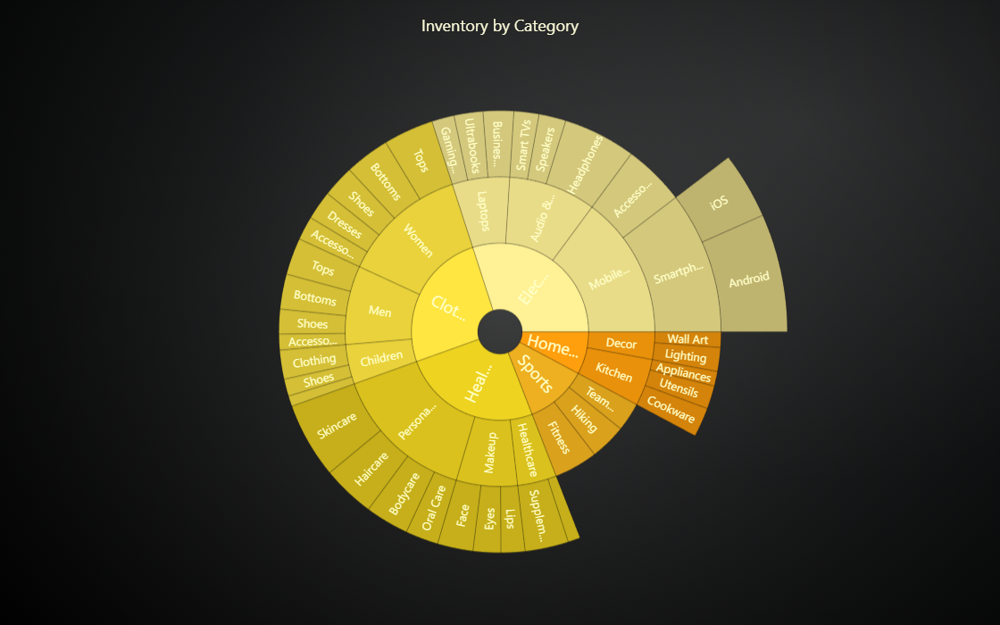

# SunBurst Chart



This demo application belongs to the set of examples for LightningChart JS, data visualization library for JavaScript.

LightningChart JS is entirely GPU accelerated and performance optimized charting library for presenting massive amounts of data. It offers an easy way of creating sophisticated and interactive charts and adding them to your website or web application.

The demo can be used as an example or a seed project. Local execution requires the following steps:

-   Make sure that relevant version of [Node.js](https://nodejs.org/en/download/) is installed
-   Open the project folder in a terminal:

          npm install              # fetches dependencies
          npm start                # builds an application and starts the development server

-   The application is available at _http://localhost:8080_ in your browser, webpack-dev-server provides hot reload functionality.


## Description

Simple overview of a SunBurst chart.

The SunBurst chart is excellent for showing how data is broken down into smaller groups. It uses a circular layout to show connections between main categories and their sub-categories.

The chart is interactive, allowing users to click on a section to zoom in and see more specific details about that part of the data.

Below is an example on how to create a SunBurst chart using predefined data with LightningChart JS:

```js
const sunBurstChart = lightningChart().SunBurstChart()
sunBurstChart.setData(data)
```

## API Links

* [SunBurst Chart]


## Support

If you notice an error in the example code, please open an issue on [GitHub][0] repository of the entire example.

Official [API documentation][1] can be found on [LightningChart][2] website.

If the docs and other materials do not solve your problem as well as implementation help is needed, ask on [StackOverflow][3] (tagged lightningchart).

If you think you found a bug in the LightningChart JavaScript library, please contact sales@lightningchart.com.

Direct developer email support can be purchased through a [Support Plan][4] or by contacting sales@lightningchart.com.

[0]: https://github.com/Arction/
[1]: https://lightningchart.com/lightningchart-js-api-documentation/
[2]: https://lightningchart.com
[3]: https://stackoverflow.com/questions/tagged/lightningchart
[4]: https://lightningchart.com/support-services/

© LightningChart Ltd 2009-2026. All rights reserved.


[SunBurst Chart]: https://lightningchart.com/js-charts/api-documentation/v8.3.0/classes/SunBurstChart.html

